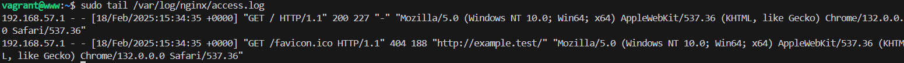
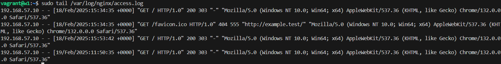
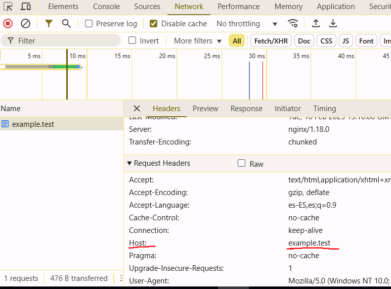
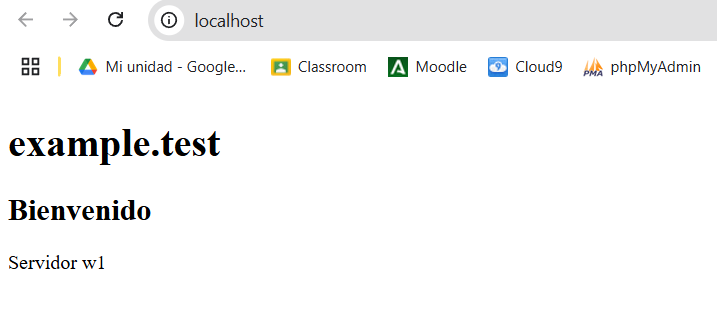
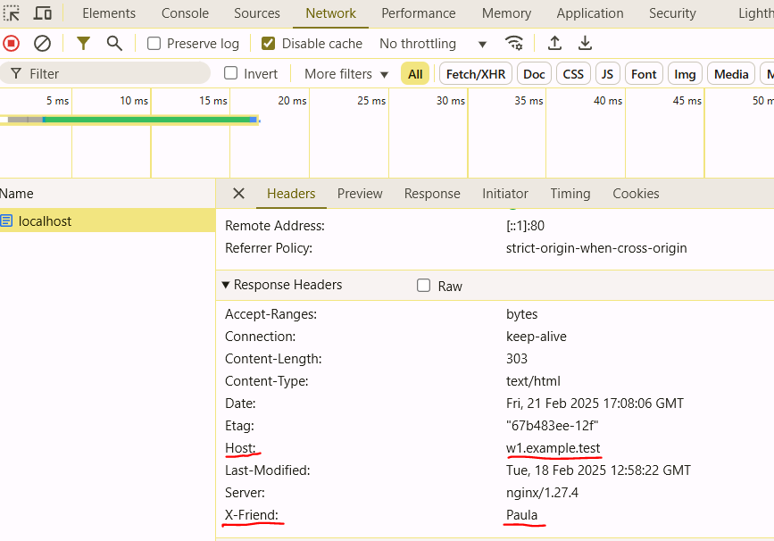

# INVERSE PROXY PRACTICE

The aim of this practice is see how inverse proxy works, using different virtual machines

# TECHNOLOGIES

- Nginx
- Docker / Vagrant

# SET UP VIRTUAL MACHINES

## Inverse Proxy

The default file server block of nginx was modified to listen at 80 port,and proxy pass access was added to link it to the virtual machine used as server:

```
server {
    listen 80;
    listen [::]:80;

    server_name example.test www.example.test;

    location / {
        proxy_pass http://192.168.57.11:8080;
    }
}
```

The hosts file must be modified to access to the web server VM, adding:

```
192.168.57.11 w1
```

The host file hosts must be modified to add the VM proxy IP and domain.

## Server w1

Default file of nginx was modified to listen at 8080 port. This way it is assured that host only access to the inverse proxy. A index.html file is added to test the access.

```
server {
    listen 8080;
    listen [::]:8080;

    server_name w1;
    root /var/www/html;
    index index.html index.htm;

    location / {
        try_files $uri $uri/ =404;
    }
}
```

# COMPROBATION

## Server Name

At this moment, we would be able to access to the index.html through the proxy server name.


## Logs

This also can be checked in the command line:





## Headers

With developer tools help, headers can be checked also.
Header request host is the same name as the proxy one. This indicates that proxy is doing the request to the server.



### Adding headers

Headers can be modified adding to the server block / location the following:

On proxy side

```
location / {
     proxy_pass http://192.168.57.11:8080;
     add_header X-friend Paula;
}
```

On server side

```
location / {
     add_header Host w1.example.test;
     try_files $uri $uri/ =404;
 }
```

# DOCKER IMAGES

Vagrant is a way to create and manage virtual machines to simulate development environments with specific configurations. However, Docker offers a lighter and more efficient alternative by using containers instead of full virtual machines.

Unlike VMs, which require a full OS for each instance, Docker containers share the same OS kernel, making them faster, more portable, and less resource-intensive.

In this section, we replicate the same setup using Docker, creating separate containers for the proxy and web servers.

## Proxy

The proxy container acts as a reverse proxy, forwarding client requests to the web container. It uses Nginx and a custom configuration file.

```
FROM nginx:latest

COPY default.conf /etc/nginx/conf.d/default.conf

```

Nginx configuration stay the same as before.

## Web

The web container is the backend server that responds to requests forwarded by the proxy. It serves a simple HTML page (index.html) through Nginx.

```
FROM nginx:latest

COPY default.conf /etc/nginx/conf.d/default.conf
COPY index.html /usr/share/nginx/html/index.html

```

Nginx configuration stay the same as before.

## Compose

To connect both containers (proxy and web), we use Docker Compose. This tool allows us to define multi-container applications and manage them as a single unit.

```
services:
  web:
    build: ./files/w1
    container_name: web
    ports:
      - "8080:8080"
    networks:
      - test-network

  proxy:
    build: ./files/proxy
    container_name: proxy
    ports:
      - "80:80"
    networks:
      - test-network
    depends_on:
      - web

networks:
  test-network:
    driver: bridge

```

This file connects both files (proxy and web) and configuration.
There main difference between virtual machines and images is paths where config files are (default config file of nginx and index.html).

Once images are built, proxy/web it is accessed in localhost.



And headers are checked:


